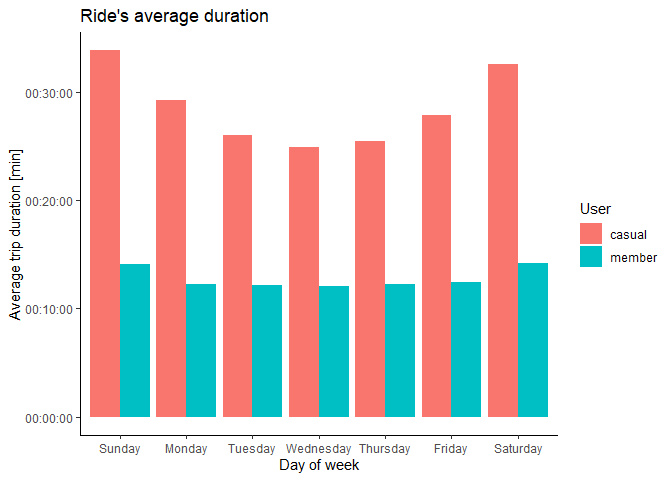
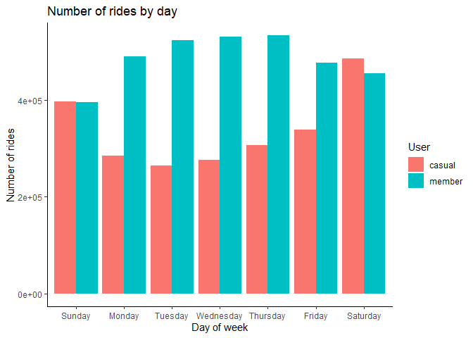
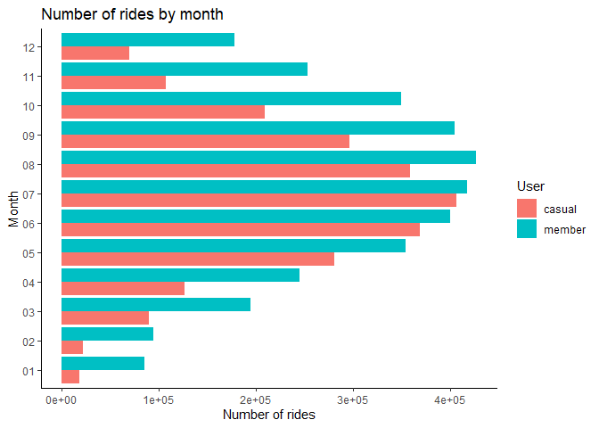
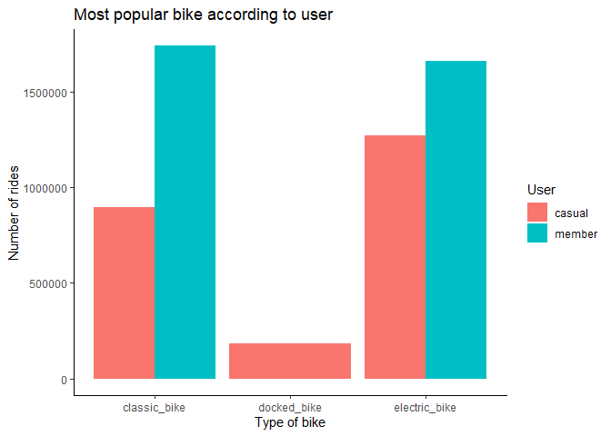
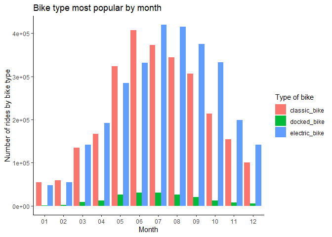

Cyclistic bike-share analysis case study
================
Guinansaca William
2022-12-14

This case study represents the *capstone project* of the Google Data
Analytics Professional Certificate on Coursera. In order to answer the
key business questions, I am going to analyze the steps of the data
analysis process: **ask, prepare, process, analyze, share, and act.**

# Ask

### Context

Cyclistic is a fictional company related to a bike-share business. It
wants to improve its profit by becoming the most of its clients in
annual memberships. The goal of the analysis is to decide the best paths
to get this improvement in the gains.

The company works with these pricing plans: single-ride passes, full-day
passes, and annual memberships. Customers who purchase single-ride or
full-day passes are referred to as casual riders. Customers who purchase
annual memberships are Cyclistic members.

Cyclistic’s finance analysts have concluded that annual members are much
more profitable than casual riders. Then, the goal is to design
marketing strategies aimed at converting casual riders into annual
members.

### Consider key stakeholders

Key stakeholders include: Cyclistic executive team, Director of
Marketing (Lily Moreno), Marketing Analytics team.

# Prepare

All the data has been downloaded from:
<https://divvy-tripdata.s3.amazonaws.com/index.html> (For the purposes
of this case study, the datasets are appropriate and will enable to
answer the business questions. The data has been made available by
Motivate International Inc. under this license.)

### Does your data ROCCC?

It is the process to identifying good data where it has to be: realible,
original, comprehensive, current and cited. Due to the fact that this is
a case study using public data, we are going to assume the data is
ROCCC.

### Identify how the data is organized

All trip data is in comma-delimited (.CSV) format with 13 columns,
including: ride ID, ride type, start/end time, starting point (station,
and latitude/longitude), ending point (station and latitude/longitude),
and member/casual rider.

# Process

### Load the packages and all the files in Rstudio

The tool use to check the data is Rstudio and its tydiverse library

``` r
# Packages installation

install.packages("tidyverse", repos = "http://cran.us.r-project.org") #to cleaning data 
```

    ## package 'tidyverse' successfully unpacked and MD5 sums checked
    ## 
    ## The downloaded binary packages are in
    ##  C:\Users\d_wil\AppData\Local\Temp\RtmpWy9oeg\downloaded_packages

``` r
install.packages("janitor", repos = "http://cran.us.r-project.org") #to cleaning data
```

    ## package 'janitor' successfully unpacked and MD5 sums checked
    ## 
    ## The downloaded binary packages are in
    ##  C:\Users\d_wil\AppData\Local\Temp\RtmpWy9oeg\downloaded_packages

``` r
install.packages("skimr", repos = "http://cran.us.r-project.org") # to statistics tools
```

    ## package 'skimr' successfully unpacked and MD5 sums checked
    ## 
    ## The downloaded binary packages are in
    ##  C:\Users\d_wil\AppData\Local\Temp\RtmpWy9oeg\downloaded_packages

``` r
install.packages("Tmisc", repos = "http://cran.us.r-project.org") # to data manipulation
```

    ## package 'Tmisc' successfully unpacked and MD5 sums checked
    ## 
    ## The downloaded binary packages are in
    ##  C:\Users\d_wil\AppData\Local\Temp\RtmpWy9oeg\downloaded_packages

``` r
install.packages("lubridate", repos = "http://cran.us.r-project.org") # to work with dates
```

    ## package 'lubridate' successfully unpacked and MD5 sums checked
    ## 
    ## The downloaded binary packages are in
    ##  C:\Users\d_wil\AppData\Local\Temp\RtmpWy9oeg\downloaded_packages

``` r
install.packages("hms", repos = "http://cran.us.r-project.org")
```

    ## package 'hms' successfully unpacked and MD5 sums checked
    ## 
    ## The downloaded binary packages are in
    ##  C:\Users\d_wil\AppData\Local\Temp\RtmpWy9oeg\downloaded_packages

``` r
install.packages("modeest", repos = "http://cran.us.r-project.org")
```

    ## package 'modeest' successfully unpacked and MD5 sums checked
    ## 
    ## The downloaded binary packages are in
    ##  C:\Users\d_wil\AppData\Local\Temp\RtmpWy9oeg\downloaded_packages

``` r
# Load the packages

library(tidyverse)
library(janitor)
library(skimr)
library(Tmisc)
library(lubridate)
library(hms)
library(modeest)
```

The code chunk below will import 12 individual files that represents the
last work year

``` r
#Read datasets

trip11_21 <- read.csv("raw_data/202111-divvy-tripdata.csv")
trip12_21 <- read.csv("raw_data/202112-divvy-tripdata.csv")
trip01_22 <- read.csv("raw_data/202201-divvy-tripdata.csv")
trip02_22 <- read.csv("raw_data/202202-divvy-tripdata.csv")
trip03_22 <- read.csv("raw_data/202203-divvy-tripdata.csv")
trip04_22 <- read.csv("raw_data/202204-divvy-tripdata.csv")
trip05_22 <- read.csv("raw_data/202205-divvy-tripdata.csv")
trip06_22 <- read.csv("raw_data/202206-divvy-tripdata.csv")
trip07_22 <- read.csv("raw_data/202207-divvy-tripdata.csv")
trip08_22 <- read.csv("raw_data/202208-divvy-tripdata.csv")
trip09_22 <- read.csv("raw_data/202209-divvy-tripdata.csv")
trip10_22 <- read.csv("raw_data/202210-divvy-tripdata.csv")
```

### Previous review to join the data into one file

Previously to combine the data into one single file, it is necessary to
compare the column names because they do need to match perfectly before
we can use a command to join them into one file.

``` r
# Check the column names
colnames(trip11_21)
```

    ##  [1] "ride_id"            "rideable_type"      "started_at"        
    ##  [4] "ended_at"           "start_station_name" "start_station_id"  
    ##  [7] "end_station_name"   "end_station_id"     "start_lat"         
    ## [10] "start_lng"          "end_lat"            "end_lng"           
    ## [13] "member_casual"

``` r
colnames(trip12_21)
```

    ##  [1] "ride_id"            "rideable_type"      "started_at"        
    ##  [4] "ended_at"           "start_station_name" "start_station_id"  
    ##  [7] "end_station_name"   "end_station_id"     "start_lat"         
    ## [10] "start_lng"          "end_lat"            "end_lng"           
    ## [13] "member_casual"

``` r
colnames(trip01_22)
```

    ##  [1] "ride_id"            "rideable_type"      "started_at"        
    ##  [4] "ended_at"           "start_station_name" "start_station_id"  
    ##  [7] "end_station_name"   "end_station_id"     "start_lat"         
    ## [10] "start_lng"          "end_lat"            "end_lng"           
    ## [13] "member_casual"

``` r
colnames(trip02_22)
```

    ##  [1] "ride_id"            "rideable_type"      "started_at"        
    ##  [4] "ended_at"           "start_station_name" "start_station_id"  
    ##  [7] "end_station_name"   "end_station_id"     "start_lat"         
    ## [10] "start_lng"          "end_lat"            "end_lng"           
    ## [13] "member_casual"

``` r
colnames(trip03_22)
```

    ##  [1] "ride_id"            "rideable_type"      "started_at"        
    ##  [4] "ended_at"           "start_station_name" "start_station_id"  
    ##  [7] "end_station_name"   "end_station_id"     "start_lat"         
    ## [10] "start_lng"          "end_lat"            "end_lng"           
    ## [13] "member_casual"

``` r
colnames(trip04_22)
```

    ##  [1] "ride_id"            "rideable_type"      "started_at"        
    ##  [4] "ended_at"           "start_station_name" "start_station_id"  
    ##  [7] "end_station_name"   "end_station_id"     "start_lat"         
    ## [10] "start_lng"          "end_lat"            "end_lng"           
    ## [13] "member_casual"

``` r
colnames(trip05_22)
```

    ##  [1] "ride_id"            "rideable_type"      "started_at"        
    ##  [4] "ended_at"           "start_station_name" "start_station_id"  
    ##  [7] "end_station_name"   "end_station_id"     "start_lat"         
    ## [10] "start_lng"          "end_lat"            "end_lng"           
    ## [13] "member_casual"

``` r
colnames(trip06_22)
```

    ##  [1] "ride_id"            "rideable_type"      "started_at"        
    ##  [4] "ended_at"           "start_station_name" "start_station_id"  
    ##  [7] "end_station_name"   "end_station_id"     "start_lat"         
    ## [10] "start_lng"          "end_lat"            "end_lng"           
    ## [13] "member_casual"

``` r
colnames(trip07_22)
```

    ##  [1] "ride_id"            "rideable_type"      "started_at"        
    ##  [4] "ended_at"           "start_station_name" "start_station_id"  
    ##  [7] "end_station_name"   "end_station_id"     "start_lat"         
    ## [10] "start_lng"          "end_lat"            "end_lng"           
    ## [13] "member_casual"

``` r
colnames(trip08_22)
```

    ##  [1] "ride_id"            "rideable_type"      "started_at"        
    ##  [4] "ended_at"           "start_station_name" "start_station_id"  
    ##  [7] "end_station_name"   "end_station_id"     "start_lat"         
    ## [10] "start_lng"          "end_lat"            "end_lng"           
    ## [13] "member_casual"

``` r
colnames(trip09_22)
```

    ##  [1] "ride_id"            "rideable_type"      "started_at"        
    ##  [4] "ended_at"           "start_station_name" "start_station_id"  
    ##  [7] "end_station_name"   "end_station_id"     "start_lat"         
    ## [10] "start_lng"          "end_lat"            "end_lng"           
    ## [13] "member_casual"

``` r
colnames(trip10_22)
```

    ##  [1] "ride_id"            "rideable_type"      "started_at"        
    ##  [4] "ended_at"           "start_station_name" "start_station_id"  
    ##  [7] "end_station_name"   "end_station_id"     "start_lat"         
    ## [10] "start_lng"          "end_lat"            "end_lng"           
    ## [13] "member_casual"

In addition, we check for the structure of the files

``` r
# Inspect the data frames and look for incongruencies
str(trip11_21)
```

    ## 'data.frame':    359978 obs. of  13 variables:
    ##  $ ride_id           : chr  "7C00A93E10556E47" "90854840DFD508BA" "0A7D10CDD144061C" "2F3BE33085BCFF02" ...
    ##  $ rideable_type     : chr  "electric_bike" "electric_bike" "electric_bike" "electric_bike" ...
    ##  $ started_at        : chr  "2021-11-27 13:27:38" "2021-11-27 13:38:25" "2021-11-26 22:03:34" "2021-11-27 09:56:49" ...
    ##  $ ended_at          : chr  "2021-11-27 13:46:38" "2021-11-27 13:56:10" "2021-11-26 22:05:56" "2021-11-27 10:01:50" ...
    ##  $ start_station_name: chr  "" "" "" "" ...
    ##  $ start_station_id  : chr  "" "" "" "" ...
    ##  $ end_station_name  : chr  "" "" "" "" ...
    ##  $ end_station_id    : chr  "" "" "" "" ...
    ##  $ start_lat         : num  41.9 42 42 41.9 41.9 ...
    ##  $ start_lng         : num  -87.7 -87.7 -87.7 -87.8 -87.6 ...
    ##  $ end_lat           : num  42 41.9 42 41.9 41.9 ...
    ##  $ end_lng           : num  -87.7 -87.7 -87.7 -87.8 -87.6 ...
    ##  $ member_casual     : chr  "casual" "casual" "casual" "casual" ...

``` r
str(trip12_21)
```

    ## 'data.frame':    247540 obs. of  13 variables:
    ##  $ ride_id           : chr  "46F8167220E4431F" "73A77762838B32FD" "4CF42452054F59C5" "3278BA87BF698339" ...
    ##  $ rideable_type     : chr  "electric_bike" "electric_bike" "electric_bike" "classic_bike" ...
    ##  $ started_at        : chr  "2021-12-07 15:06:07" "2021-12-11 03:43:29" "2021-12-15 23:10:28" "2021-12-26 16:16:10" ...
    ##  $ ended_at          : chr  "2021-12-07 15:13:42" "2021-12-11 04:10:23" "2021-12-15 23:23:14" "2021-12-26 16:30:53" ...
    ##  $ start_station_name: chr  "Laflin St & Cullerton St" "LaSalle Dr & Huron St" "Halsted St & North Branch St" "Halsted St & North Branch St" ...
    ##  $ start_station_id  : chr  "13307" "KP1705001026" "KA1504000117" "KA1504000117" ...
    ##  $ end_station_name  : chr  "Morgan St & Polk St" "Clarendon Ave & Leland Ave" "Broadway & Barry Ave" "LaSalle Dr & Huron St" ...
    ##  $ end_station_id    : chr  "TA1307000130" "TA1307000119" "13137" "KP1705001026" ...
    ##  $ start_lat         : num  41.9 41.9 41.9 41.9 41.9 ...
    ##  $ start_lng         : num  -87.7 -87.6 -87.6 -87.6 -87.7 ...
    ##  $ end_lat           : num  41.9 42 41.9 41.9 41.9 ...
    ##  $ end_lng           : num  -87.7 -87.7 -87.6 -87.6 -87.6 ...
    ##  $ member_casual     : chr  "member" "casual" "member" "member" ...

``` r
str(trip01_22)
```

    ## 'data.frame':    103770 obs. of  13 variables:
    ##  $ ride_id           : chr  "C2F7DD78E82EC875" "A6CF8980A652D272" "BD0F91DFF741C66D" "CBB80ED419105406" ...
    ##  $ rideable_type     : chr  "electric_bike" "electric_bike" "classic_bike" "classic_bike" ...
    ##  $ started_at        : chr  "2022-01-13 11:59:47" "2022-01-10 08:41:56" "2022-01-25 04:53:40" "2022-01-04 00:18:04" ...
    ##  $ ended_at          : chr  "2022-01-13 12:02:44" "2022-01-10 08:46:17" "2022-01-25 04:58:01" "2022-01-04 00:33:00" ...
    ##  $ start_station_name: chr  "Glenwood Ave & Touhy Ave" "Glenwood Ave & Touhy Ave" "Sheffield Ave & Fullerton Ave" "Clark St & Bryn Mawr Ave" ...
    ##  $ start_station_id  : chr  "525" "525" "TA1306000016" "KA1504000151" ...
    ##  $ end_station_name  : chr  "Clark St & Touhy Ave" "Clark St & Touhy Ave" "Greenview Ave & Fullerton Ave" "Paulina St & Montrose Ave" ...
    ##  $ end_station_id    : chr  "RP-007" "RP-007" "TA1307000001" "TA1309000021" ...
    ##  $ start_lat         : num  42 42 41.9 42 41.9 ...
    ##  $ start_lng         : num  -87.7 -87.7 -87.7 -87.7 -87.6 ...
    ##  $ end_lat           : num  42 42 41.9 42 41.9 ...
    ##  $ end_lng           : num  -87.7 -87.7 -87.7 -87.7 -87.6 ...
    ##  $ member_casual     : chr  "casual" "casual" "member" "casual" ...

``` r
str(trip02_22)
```

    ## 'data.frame':    115609 obs. of  13 variables:
    ##  $ ride_id           : chr  "E1E065E7ED285C02" "1602DCDC5B30FFE3" "BE7DD2AF4B55C4AF" "A1789BDF844412BE" ...
    ##  $ rideable_type     : chr  "classic_bike" "classic_bike" "classic_bike" "classic_bike" ...
    ##  $ started_at        : chr  "2022-02-19 18:08:41" "2022-02-20 17:41:30" "2022-02-25 18:55:56" "2022-02-14 11:57:03" ...
    ##  $ ended_at          : chr  "2022-02-19 18:23:56" "2022-02-20 17:45:56" "2022-02-25 19:09:34" "2022-02-14 12:04:00" ...
    ##  $ start_station_name: chr  "State St & Randolph St" "Halsted St & Wrightwood Ave" "State St & Randolph St" "Southport Ave & Waveland Ave" ...
    ##  $ start_station_id  : chr  "TA1305000029" "TA1309000061" "TA1305000029" "13235" ...
    ##  $ end_station_name  : chr  "Clark St & Lincoln Ave" "Southport Ave & Wrightwood Ave" "Canal St & Adams St" "Broadway & Sheridan Rd" ...
    ##  $ end_station_id    : chr  "13179" "TA1307000113" "13011" "13323" ...
    ##  $ start_lat         : num  41.9 41.9 41.9 41.9 41.9 ...
    ##  $ start_lng         : num  -87.6 -87.6 -87.6 -87.7 -87.6 ...
    ##  $ end_lat           : num  41.9 41.9 41.9 42 41.9 ...
    ##  $ end_lng           : num  -87.6 -87.7 -87.6 -87.6 -87.6 ...
    ##  $ member_casual     : chr  "member" "member" "member" "member" ...

``` r
str(trip03_22)
```

    ## 'data.frame':    284042 obs. of  13 variables:
    ##  $ ride_id           : chr  "47EC0A7F82E65D52" "8494861979B0F477" "EFE527AF80B66109" "9F446FD9DEE3F389" ...
    ##  $ rideable_type     : chr  "classic_bike" "electric_bike" "classic_bike" "classic_bike" ...
    ##  $ started_at        : chr  "2022-03-21 13:45:01" "2022-03-16 09:37:16" "2022-03-23 19:52:02" "2022-03-01 19:12:26" ...
    ##  $ ended_at          : chr  "2022-03-21 13:51:18" "2022-03-16 09:43:34" "2022-03-23 19:54:48" "2022-03-01 19:22:14" ...
    ##  $ start_station_name: chr  "Wabash Ave & Wacker Pl" "Michigan Ave & Oak St" "Broadway & Berwyn Ave" "Wabash Ave & Wacker Pl" ...
    ##  $ start_station_id  : chr  "TA1307000131" "13042" "13109" "TA1307000131" ...
    ##  $ end_station_name  : chr  "Kingsbury St & Kinzie St" "Orleans St & Chestnut St (NEXT Apts)" "Broadway & Ridge Ave" "Franklin St & Jackson Blvd" ...
    ##  $ end_station_id    : chr  "KA1503000043" "620" "15578" "TA1305000025" ...
    ##  $ start_lat         : num  41.9 41.9 42 41.9 41.9 ...
    ##  $ start_lng         : num  -87.6 -87.6 -87.7 -87.6 -87.6 ...
    ##  $ end_lat           : num  41.9 41.9 42 41.9 41.9 ...
    ##  $ end_lng           : num  -87.6 -87.6 -87.7 -87.6 -87.7 ...
    ##  $ member_casual     : chr  "member" "member" "member" "member" ...

``` r
str(trip04_22)
```

    ## 'data.frame':    371249 obs. of  13 variables:
    ##  $ ride_id           : chr  "3564070EEFD12711" "0B820C7FCF22F489" "89EEEE32293F07FF" "84D4751AEB31888D" ...
    ##  $ rideable_type     : chr  "electric_bike" "classic_bike" "classic_bike" "classic_bike" ...
    ##  $ started_at        : chr  "2022-04-06 17:42:48" "2022-04-24 19:23:07" "2022-04-20 19:29:08" "2022-04-22 21:14:06" ...
    ##  $ ended_at          : chr  "2022-04-06 17:54:36" "2022-04-24 19:43:17" "2022-04-20 19:35:16" "2022-04-22 21:23:29" ...
    ##  $ start_station_name: chr  "Paulina St & Howard St" "Wentworth Ave & Cermak Rd" "Halsted St & Polk St" "Wentworth Ave & Cermak Rd" ...
    ##  $ start_station_id  : chr  "515" "13075" "TA1307000121" "13075" ...
    ##  $ end_station_name  : chr  "University Library (NU)" "Green St & Madison St" "Green St & Madison St" "Delano Ct & Roosevelt Rd" ...
    ##  $ end_station_id    : chr  "605" "TA1307000120" "TA1307000120" "KA1706005007" ...
    ##  $ start_lat         : num  42 41.9 41.9 41.9 41.9 ...
    ##  $ start_lng         : num  -87.7 -87.6 -87.6 -87.6 -87.6 ...
    ##  $ end_lat           : num  42.1 41.9 41.9 41.9 41.9 ...
    ##  $ end_lng           : num  -87.7 -87.6 -87.6 -87.6 -87.6 ...
    ##  $ member_casual     : chr  "member" "member" "member" "casual" ...

``` r
str(trip05_22)
```

    ## 'data.frame':    634858 obs. of  13 variables:
    ##  $ ride_id           : chr  "EC2DE40644C6B0F4" "1C31AD03897EE385" "1542FBEC830415CF" "6FF59852924528F8" ...
    ##  $ rideable_type     : chr  "classic_bike" "classic_bike" "classic_bike" "classic_bike" ...
    ##  $ started_at        : chr  "2022-05-23 23:06:58" "2022-05-11 08:53:28" "2022-05-26 18:36:28" "2022-05-10 07:30:07" ...
    ##  $ ended_at          : chr  "2022-05-23 23:40:19" "2022-05-11 09:31:22" "2022-05-26 18:58:18" "2022-05-10 07:38:49" ...
    ##  $ start_station_name: chr  "Wabash Ave & Grand Ave" "DuSable Lake Shore Dr & Monroe St" "Clinton St & Madison St" "Clinton St & Madison St" ...
    ##  $ start_station_id  : chr  "TA1307000117" "13300" "TA1305000032" "TA1305000032" ...
    ##  $ end_station_name  : chr  "Halsted St & Roscoe St" "Field Blvd & South Water St" "Wood St & Milwaukee Ave" "Clark St & Randolph St" ...
    ##  $ end_station_id    : chr  "TA1309000025" "15534" "13221" "TA1305000030" ...
    ##  $ start_lat         : num  41.9 41.9 41.9 41.9 41.9 ...
    ##  $ start_lng         : num  -87.6 -87.6 -87.6 -87.6 -87.6 ...
    ##  $ end_lat           : num  41.9 41.9 41.9 41.9 41.9 ...
    ##  $ end_lng           : num  -87.6 -87.6 -87.7 -87.6 -87.7 ...
    ##  $ member_casual     : chr  "member" "member" "member" "member" ...

``` r
str(trip06_22)
```

    ## 'data.frame':    769204 obs. of  13 variables:
    ##  $ ride_id           : chr  "600CFD130D0FD2A4" "F5E6B5C1682C6464" "B6EB6D27BAD771D2" "C9C320375DE1D5C6" ...
    ##  $ rideable_type     : chr  "electric_bike" "electric_bike" "electric_bike" "electric_bike" ...
    ##  $ started_at        : chr  "2022-06-30 17:27:53" "2022-06-30 18:39:52" "2022-06-30 11:49:25" "2022-06-30 11:15:25" ...
    ##  $ ended_at          : chr  "2022-06-30 17:35:15" "2022-06-30 18:47:28" "2022-06-30 12:02:54" "2022-06-30 11:19:43" ...
    ##  $ start_station_name: chr  "" "" "" "" ...
    ##  $ start_station_id  : chr  "" "" "" "" ...
    ##  $ end_station_name  : chr  "" "" "" "" ...
    ##  $ end_station_id    : chr  "" "" "" "" ...
    ##  $ start_lat         : num  41.9 41.9 41.9 41.8 41.9 ...
    ##  $ start_lng         : num  -87.6 -87.6 -87.7 -87.7 -87.6 ...
    ##  $ end_lat           : num  41.9 41.9 41.9 41.8 41.9 ...
    ##  $ end_lng           : num  -87.6 -87.6 -87.6 -87.7 -87.6 ...
    ##  $ member_casual     : chr  "casual" "casual" "casual" "casual" ...

``` r
str(trip07_22)
```

    ## 'data.frame':    823488 obs. of  13 variables:
    ##  $ ride_id           : chr  "954144C2F67B1932" "292E027607D218B6" "57765852588AD6E0" "B5B6BE44314590E6" ...
    ##  $ rideable_type     : chr  "classic_bike" "classic_bike" "classic_bike" "classic_bike" ...
    ##  $ started_at        : chr  "2022-07-05 08:12:47" "2022-07-26 12:53:38" "2022-07-03 13:58:49" "2022-07-31 17:44:21" ...
    ##  $ ended_at          : chr  "2022-07-05 08:24:32" "2022-07-26 12:55:31" "2022-07-03 14:06:32" "2022-07-31 18:42:50" ...
    ##  $ start_station_name: chr  "Ashland Ave & Blackhawk St" "Buckingham Fountain (Temp)" "Buckingham Fountain (Temp)" "Buckingham Fountain (Temp)" ...
    ##  $ start_station_id  : chr  "13224" "15541" "15541" "15541" ...
    ##  $ end_station_name  : chr  "Kingsbury St & Kinzie St" "Michigan Ave & 8th St" "Michigan Ave & 8th St" "Woodlawn Ave & 55th St" ...
    ##  $ end_station_id    : chr  "KA1503000043" "623" "623" "TA1307000164" ...
    ##  $ start_lat         : num  41.9 41.9 41.9 41.9 41.9 ...
    ##  $ start_lng         : num  -87.7 -87.6 -87.6 -87.6 -87.6 ...
    ##  $ end_lat           : num  41.9 41.9 41.9 41.8 41.9 ...
    ##  $ end_lng           : num  -87.6 -87.6 -87.6 -87.6 -87.7 ...
    ##  $ member_casual     : chr  "member" "casual" "casual" "casual" ...

``` r
str(trip08_22)
```

    ## 'data.frame':    785932 obs. of  13 variables:
    ##  $ ride_id           : chr  "550CF7EFEAE0C618" "DAD198F405F9C5F5" "E6F2BC47B65CB7FD" "F597830181C2E13C" ...
    ##  $ rideable_type     : chr  "electric_bike" "electric_bike" "electric_bike" "electric_bike" ...
    ##  $ started_at        : chr  "2022-08-07 21:34:15" "2022-08-08 14:39:21" "2022-08-08 15:29:50" "2022-08-08 02:43:50" ...
    ##  $ ended_at          : chr  "2022-08-07 21:41:46" "2022-08-08 14:53:23" "2022-08-08 15:40:34" "2022-08-08 02:58:53" ...
    ##  $ start_station_name: chr  "" "" "" "" ...
    ##  $ start_station_id  : chr  "" "" "" "" ...
    ##  $ end_station_name  : chr  "" "" "" "" ...
    ##  $ end_station_id    : chr  "" "" "" "" ...
    ##  $ start_lat         : num  41.9 41.9 42 41.9 41.9 ...
    ##  $ start_lng         : num  -87.7 -87.6 -87.7 -87.7 -87.7 ...
    ##  $ end_lat           : num  41.9 41.9 42 42 41.8 ...
    ##  $ end_lng           : num  -87.7 -87.6 -87.7 -87.7 -87.7 ...
    ##  $ member_casual     : chr  "casual" "casual" "casual" "casual" ...

``` r
str(trip09_22)
```

    ## 'data.frame':    701339 obs. of  13 variables:
    ##  $ ride_id           : chr  "5156990AC19CA285" "E12D4A16BF51C274" "A02B53CD7DB72DD7" "C82E05FEE872DF11" ...
    ##  $ rideable_type     : chr  "electric_bike" "electric_bike" "electric_bike" "electric_bike" ...
    ##  $ started_at        : chr  "2022-09-01 08:36:22" "2022-09-01 17:11:29" "2022-09-01 17:15:50" "2022-09-01 09:00:28" ...
    ##  $ ended_at          : chr  "2022-09-01 08:39:05" "2022-09-01 17:14:45" "2022-09-01 17:16:12" "2022-09-01 09:10:32" ...
    ##  $ start_station_name: chr  "" "" "" "" ...
    ##  $ start_station_id  : chr  "" "" "" "" ...
    ##  $ end_station_name  : chr  "California Ave & Milwaukee Ave" "" "" "" ...
    ##  $ end_station_id    : chr  "13084" "" "" "" ...
    ##  $ start_lat         : num  41.9 41.9 41.9 41.9 41.9 ...
    ##  $ start_lng         : num  -87.7 -87.6 -87.6 -87.7 -87.7 ...
    ##  $ end_lat           : num  41.9 41.9 41.9 41.9 41.9 ...
    ##  $ end_lng           : num  -87.7 -87.6 -87.6 -87.7 -87.7 ...
    ##  $ member_casual     : chr  "casual" "casual" "casual" "casual" ...

``` r
str(trip10_22)
```

    ## 'data.frame':    558685 obs. of  13 variables:
    ##  $ ride_id           : chr  "A50255C1E17942AB" "DB692A70BD2DD4E3" "3C02727AAF60F873" "47E653FDC2D99236" ...
    ##  $ rideable_type     : chr  "classic_bike" "electric_bike" "electric_bike" "electric_bike" ...
    ##  $ started_at        : chr  "2022-10-14 17:13:30" "2022-10-01 16:29:26" "2022-10-19 18:55:40" "2022-10-31 07:52:36" ...
    ##  $ ended_at          : chr  "2022-10-14 17:19:39" "2022-10-01 16:49:06" "2022-10-19 19:03:30" "2022-10-31 07:58:49" ...
    ##  $ start_station_name: chr  "Noble St & Milwaukee Ave" "Damen Ave & Charleston St" "Hoyne Ave & Balmoral Ave" "Rush St & Cedar St" ...
    ##  $ start_station_id  : chr  "13290" "13288" "655" "KA1504000133" ...
    ##  $ end_station_name  : chr  "Larrabee St & Division St" "Damen Ave & Cullerton St" "Western Ave & Leland Ave" "Orleans St & Chestnut St (NEXT Apts)" ...
    ##  $ end_station_id    : chr  "KA1504000079" "13089" "TA1307000140" "620" ...
    ##  $ start_lat         : num  41.9 41.9 42 41.9 41.9 ...
    ##  $ start_lng         : num  -87.7 -87.7 -87.7 -87.6 -87.6 ...
    ##  $ end_lat           : num  41.9 41.9 42 41.9 41.9 ...
    ##  $ end_lng           : num  -87.6 -87.7 -87.7 -87.6 -87.6 ...
    ##  $ member_casual     : chr  "member" "casual" "member" "member" ...

### Merge the data into one data frame

The data has the same column names and data types, so it can be merge.

``` r
# Merge individual files into one data frame

df <- rbind(trip11_21, trip12_21, trip01_22, trip02_22, trip03_22, trip04_22, trip05_22, trip06_22, trip07_22, trip08_22, trip09_22, trip10_22)

# Glance the data frame
str(df)
```

    ## 'data.frame':    5755694 obs. of  13 variables:
    ##  $ ride_id           : chr  "7C00A93E10556E47" "90854840DFD508BA" "0A7D10CDD144061C" "2F3BE33085BCFF02" ...
    ##  $ rideable_type     : chr  "electric_bike" "electric_bike" "electric_bike" "electric_bike" ...
    ##  $ started_at        : chr  "2021-11-27 13:27:38" "2021-11-27 13:38:25" "2021-11-26 22:03:34" "2021-11-27 09:56:49" ...
    ##  $ ended_at          : chr  "2021-11-27 13:46:38" "2021-11-27 13:56:10" "2021-11-26 22:05:56" "2021-11-27 10:01:50" ...
    ##  $ start_station_name: chr  "" "" "" "" ...
    ##  $ start_station_id  : chr  "" "" "" "" ...
    ##  $ end_station_name  : chr  "" "" "" "" ...
    ##  $ end_station_id    : chr  "" "" "" "" ...
    ##  $ start_lat         : num  41.9 42 42 41.9 41.9 ...
    ##  $ start_lng         : num  -87.7 -87.7 -87.7 -87.8 -87.6 ...
    ##  $ end_lat           : num  42 41.9 42 41.9 41.9 ...
    ##  $ end_lng           : num  -87.7 -87.7 -87.7 -87.8 -87.6 ...
    ##  $ member_casual     : chr  "casual" "casual" "casual" "casual" ...

### Cleaning data

Identify and count missing data:

``` r
sum(is.na(df))
```

    ## [1] 11670

Statistical summary of numerical variables:

``` r
summary(df)
```

    ##    ride_id          rideable_type       started_at          ended_at        
    ##  Length:5755694     Length:5755694     Length:5755694     Length:5755694    
    ##  Class :character   Class :character   Class :character   Class :character  
    ##  Mode  :character   Mode  :character   Mode  :character   Mode  :character  
    ##                                                                             
    ##                                                                             
    ##                                                                             
    ##                                                                             
    ##  start_station_name start_station_id   end_station_name   end_station_id    
    ##  Length:5755694     Length:5755694     Length:5755694     Length:5755694    
    ##  Class :character   Class :character   Class :character   Class :character  
    ##  Mode  :character   Mode  :character   Mode  :character   Mode  :character  
    ##                                                                             
    ##                                                                             
    ##                                                                             
    ##                                                                             
    ##    start_lat       start_lng         end_lat         end_lng      
    ##  Min.   :41.64   Min.   :-87.84   Min.   :41.39   Min.   :-88.97  
    ##  1st Qu.:41.88   1st Qu.:-87.66   1st Qu.:41.88   1st Qu.:-87.66  
    ##  Median :41.90   Median :-87.64   Median :41.90   Median :-87.64  
    ##  Mean   :41.90   Mean   :-87.65   Mean   :41.90   Mean   :-87.65  
    ##  3rd Qu.:41.93   3rd Qu.:-87.63   3rd Qu.:41.93   3rd Qu.:-87.63  
    ##  Max.   :45.64   Max.   :-73.80   Max.   :42.37   Max.   :-87.30  
    ##                                   NA's   :5835    NA's   :5835    
    ##  member_casual     
    ##  Length:5755694    
    ##  Class :character  
    ##  Mode  :character  
    ##                    
    ##                    
    ##                    
    ## 

Get unique values of the categorical variable:

``` r
# Unique values for member_casual column
unique(df$member_casual)
```

    ## [1] "casual" "member"

``` r
# Unique values for rideable_type column
unique(df$rideable_type)
```

    ## [1] "electric_bike" "classic_bike"  "docked_bike"

Count occurrences of each category in a categorical variable:

``` r
# 
table(df$member_casual)
```

    ## 
    ##  casual  member 
    ## 2353033 3402661

``` r
sum(table(df$member_casual))
```

    ## [1] 5755694

``` r
table(df$rideable_type)
```

    ## 
    ##  classic_bike   docked_bike electric_bike 
    ##       2637937        182205       2935552

``` r
sum(table(df$rideable_type))
```

    ## [1] 5755694

Identify duplicates:

``` r
# Identify duplicates
dups <- duplicated(df$ride_id)

# Show the duplicated rows
df[dups, ]
```

    ##  [1] ride_id            rideable_type      started_at         ended_at          
    ##  [5] start_station_name start_station_id   end_station_name   end_station_id    
    ##  [9] start_lat          start_lng          end_lat            end_lng           
    ## [13] member_casual     
    ## <0 rows> (or 0-length row.names)

Look for empty or blank values:

``` r
colSums(df=="")
```

    ##            ride_id      rideable_type         started_at           ended_at 
    ##                  0                  0                  0                  0 
    ## start_station_name   start_station_id   end_station_name     end_station_id 
    ##             878177             878177             940010             940010 
    ##          start_lat          start_lng            end_lat            end_lng 
    ##                  0                  0                 NA                 NA 
    ##      member_casual 
    ##                  0

The columns related to the analysis does not contain empty values.

Identify whitespaces:

``` r
sum(grepl("^\\s*$", df$ride_id))
```

    ## [1] 0

``` r
sum(grepl("^\\s*$", df$rideable_type))
```

    ## [1] 0

``` r
sum(grepl("^\\s*$", df$started_at))
```

    ## [1] 0

``` r
sum(grepl("^\\s*$", df$member_casual))
```

    ## [1] 0

### Transform the data to work with it effectively

It can be erased the columns which are not going to use:

``` r
# Delete the columns
df1 <- select(df, -start_lat, -start_lng, -end_lat, -end_lng)

# Glance the data frame
skim_without_charts(df1)
```

|                                                  |         |
|:-------------------------------------------------|:--------|
| Name                                             | df1     |
| Number of rows                                   | 5755694 |
| Number of columns                                | 9       |
| \_\_\_\_\_\_\_\_\_\_\_\_\_\_\_\_\_\_\_\_\_\_\_   |         |
| Column type frequency:                           |         |
| character                                        | 9       |
| \_\_\_\_\_\_\_\_\_\_\_\_\_\_\_\_\_\_\_\_\_\_\_\_ |         |
| Group variables                                  | None    |

Data summary

**Variable type: character**

| skim_variable      | n_missing | complete_rate | min | max |  empty | n_unique | whitespace |
|:-------------------|----------:|--------------:|----:|----:|-------:|---------:|-----------:|
| ride_id            |         0 |             1 |  16 |  16 |      0 |  5755694 |          0 |
| rideable_type      |         0 |             1 |  11 |  13 |      0 |        3 |          0 |
| started_at         |         0 |             1 |  19 |  19 |      0 |  4824622 |          0 |
| ended_at           |         0 |             1 |  19 |  19 |      0 |  4836310 |          0 |
| start_station_name |         0 |             1 |   0 |  64 | 878177 |     1640 |          0 |
| start_station_id   |         0 |             1 |   0 |  44 | 878177 |     1307 |          0 |
| end_station_name   |         0 |             1 |   0 |  64 | 940010 |     1664 |          0 |
| end_station_id     |         0 |             1 |   0 |  44 | 940010 |     1315 |          0 |
| member_casual      |         0 |             1 |   6 |   6 |      0 |        2 |          0 |

To add some additional columns of data – such as day, month, year – that
provide additional opportunities to aggregate the data.

``` r
df11 <- df1 %>%
  mutate(date = as.Date(started_at, "%Y-%m-%d")) %>%
  mutate(month = format(as.Date(started_at, "%Y-%m-%d"), "%m")) %>% 
  mutate(day = format(as.Date(started_at, "%Y-%m-%d"), "%d")) %>% 
  mutate(year = format(as.Date(started_at, "%Y-%m-%d"), "%Y")) %>% 
  mutate(day_of_week = format(as.Date(started_at, "%Y-%m-%d"), "%A"))

str(df11)
```

    ## 'data.frame':    5755694 obs. of  14 variables:
    ##  $ ride_id           : chr  "7C00A93E10556E47" "90854840DFD508BA" "0A7D10CDD144061C" "2F3BE33085BCFF02" ...
    ##  $ rideable_type     : chr  "electric_bike" "electric_bike" "electric_bike" "electric_bike" ...
    ##  $ started_at        : chr  "2021-11-27 13:27:38" "2021-11-27 13:38:25" "2021-11-26 22:03:34" "2021-11-27 09:56:49" ...
    ##  $ ended_at          : chr  "2021-11-27 13:46:38" "2021-11-27 13:56:10" "2021-11-26 22:05:56" "2021-11-27 10:01:50" ...
    ##  $ start_station_name: chr  "" "" "" "" ...
    ##  $ start_station_id  : chr  "" "" "" "" ...
    ##  $ end_station_name  : chr  "" "" "" "" ...
    ##  $ end_station_id    : chr  "" "" "" "" ...
    ##  $ member_casual     : chr  "casual" "casual" "casual" "casual" ...
    ##  $ date              : Date, format: "2021-11-27" "2021-11-27" ...
    ##  $ month             : chr  "11" "11" "11" "11" ...
    ##  $ day               : chr  "27" "27" "26" "27" ...
    ##  $ year              : chr  "2021" "2021" "2021" "2021" ...
    ##  $ day_of_week       : chr  "Saturday" "Saturday" "Friday" "Saturday" ...

Besides, it will be to add a *ride_length* calculation in seconds and
hours

``` r
# Add a ride_length column

df12 <- df11 %>% 
  mutate(ride_length_sec = difftime(ended_at, started_at),
         ride_length_hrs = as_hms(difftime(ended_at, started_at)))

str(df12)
```

    ## 'data.frame':    5755694 obs. of  16 variables:
    ##  $ ride_id           : chr  "7C00A93E10556E47" "90854840DFD508BA" "0A7D10CDD144061C" "2F3BE33085BCFF02" ...
    ##  $ rideable_type     : chr  "electric_bike" "electric_bike" "electric_bike" "electric_bike" ...
    ##  $ started_at        : chr  "2021-11-27 13:27:38" "2021-11-27 13:38:25" "2021-11-26 22:03:34" "2021-11-27 09:56:49" ...
    ##  $ ended_at          : chr  "2021-11-27 13:46:38" "2021-11-27 13:56:10" "2021-11-26 22:05:56" "2021-11-27 10:01:50" ...
    ##  $ start_station_name: chr  "" "" "" "" ...
    ##  $ start_station_id  : chr  "" "" "" "" ...
    ##  $ end_station_name  : chr  "" "" "" "" ...
    ##  $ end_station_id    : chr  "" "" "" "" ...
    ##  $ member_casual     : chr  "casual" "casual" "casual" "casual" ...
    ##  $ date              : Date, format: "2021-11-27" "2021-11-27" ...
    ##  $ month             : chr  "11" "11" "11" "11" ...
    ##  $ day               : chr  "27" "27" "26" "27" ...
    ##  $ year              : chr  "2021" "2021" "2021" "2021" ...
    ##  $ day_of_week       : chr  "Saturday" "Saturday" "Friday" "Saturday" ...
    ##  $ ride_length_sec   : 'difftime' num  1140 1065 142 301 ...
    ##   ..- attr(*, "units")= chr "secs"
    ##  $ ride_length_hrs   : 'hms' num  00:19:00 00:17:45 00:02:22 00:05:01 ...
    ##   ..- attr(*, "units")= chr "secs"

# Analyze

### Descriptive analysis

Let’s get a general overview of the data and identify any patterns or
trends in the data.

``` r
# Compare members and casual users

aggregate(df12$ride_length_sec ~ df12$member_casual, FUN = mean)
```

    ##   df12$member_casual df12$ride_length_sec
    ## 1             casual       1750.2063 secs
    ## 2             member        762.6631 secs

``` r
aggregate(df12$ride_length_sec ~ df12$member_casual, FUN = median)
```

    ##   df12$member_casual df12$ride_length_sec
    ## 1             casual             790 secs
    ## 2             member             530 secs

``` r
aggregate(df12$ride_length_sec ~ df12$member_casual, FUN = max)
```

    ##   df12$member_casual df12$ride_length_sec
    ## 1             casual         2483235 secs
    ## 2             member           93594 secs

``` r
aggregate(df12$ride_length_sec ~ df12$member_casual, FUN = min)
```

    ##   df12$member_casual df12$ride_length_sec
    ## 1             casual           -8245 secs
    ## 2             member         -621201 secs

There are negative values that are affecting the results and these need
to be erased it.

``` r
# Clear values with a condition
df4 <- df12[!(df12$start_station_name == "HQ QR" | df12$ride_length_sec<=0),]

# Check for negative values
as_hms(min(df4$ride_length_sec))
```

    ## 00:00:01

### Average of the ride length

``` r
# Average in hrs and sec
avg_hrs <- as_hms(mean(df4$ride_length_sec))
avg_sec <- mean(df4$ride_length_sec)

avg_hrs
```

    ## 00:19:26.647875

``` r
avg_sec
```

    ## Time difference of 1166.648 secs

### Average of the ride length by type of cyclist

``` r
aggregate(df4$ride_length_sec ~ df4$member_casual, FUN = mean)
```

    ##   df4$member_casual df4$ride_length_sec
    ## 1            casual      1750.4713 secs
    ## 2            member       762.9333 secs

### Check for the mode

``` r
tabla_frec <- table(df4$day_of_week)    # Create a frequency table
moda_day_of_week <- names(tabla_frec)[which.max(tabla_frec)] # Find the more frequently value

tabla_frec1 <- table(df4$month)    
mode_month <- names(tabla_frec1)[which.max(tabla_frec1)]

moda_day_of_week
```

    ## [1] "Saturday"

``` r
mode_month
```

    ## [1] "07"

### Check for the mode by type of cyclist

``` r
aggregate(df4$day_of_week ~ df4$member_casual, FUN = mfv)
```

    ##   df4$member_casual df4$day_of_week
    ## 1            casual        Saturday
    ## 2            member        Thursday

### Check for the most popular bike by user

``` r
aggregate(df4$rideable_type ~ df4$member_casual, FUN = mfv)
```

    ##   df4$member_casual df4$rideable_type
    ## 1            casual     electric_bike
    ## 2            member      classic_bike

### The average ride length at day by type of cyclist

``` r
df4$day_of_week <- ordered(df4$day_of_week, levels=c("Sunday", "Monday", "Tuesday", "Wednesday", "Thursday", "Friday", "Saturday"))

aggregate(df4$ride_length_sec ~ df4$member_casual + df4$day_of_week, FUN = mean)
```

    ##    df4$member_casual df4$day_of_week df4$ride_length_sec
    ## 1             casual          Sunday      2031.2615 secs
    ## 2             member          Sunday       844.8062 secs
    ## 3             casual          Monday      1757.7462 secs
    ## 4             member          Monday       737.7549 secs
    ## 5             casual         Tuesday      1561.3252 secs
    ## 6             member         Tuesday       728.1484 secs
    ## 7             casual       Wednesday      1494.4893 secs
    ## 8             member       Wednesday       724.8220 secs
    ## 9             casual        Thursday      1528.4016 secs
    ## 10            member        Thursday       734.9248 secs
    ## 11            casual          Friday      1674.5428 secs
    ## 12            member          Friday       748.7009 secs
    ## 13            casual        Saturday      1958.2785 secs
    ## 14            member        Saturday       851.0283 secs

#### Identify trends and relationships

- Casual user has more longer rides than members. It determines the
  behavior because casual user can use this service because of tourism
  or a time relax. While member user needs this service because of time
  saving when they go to work, school, etc.

- In addition, the most popular day for a ride for casual users is
  Saturday, unlike the members users and their Thursday popular day.

- Both have their relax time during weekend, however for the casual
  users this day is Sunday, while for member users this day is Saturday.

# Share

Create effective data visualizations

``` r
# Ride's average duration
df4 %>% 
  group_by(member_casual, day_of_week) %>% 
  summarize(average_duration = as_hms(mean(ride_length_sec))) %>% 
  arrange(member_casual, day_of_week) %>% 
  ggplot(aes(day_of_week, average_duration, fill = member_casual)) + 
  geom_col(position = "dodge") + labs(x = "Day of week", y = "Average trip duration [min]", title = "Ride's average duration", fill = "User") + theme_classic()
```

    ## `summarise()` has grouped output by 'member_casual'. You can override using the
    ## `.groups` argument.

<!-- -->
The rent by member users keep its behavior during the workweek. In both
cases, there are more longer trips during the weekend.

``` r
# number of rides by rider type 
df4 %>% 
  group_by(member_casual, day_of_week) %>% 
  summarize(number_of_rides = n()) %>% 
  arrange(member_casual, day_of_week) %>% 
  ggplot(aes(day_of_week, number_of_rides, fill = member_casual)) + 
  geom_col(position = "dodge") + labs(x = "Day of week", y = "Number of rides", title = "Number of rides by day", fill = "User") + theme_classic()
```

    ## `summarise()` has grouped output by 'member_casual'. You can override using the
    ## `.groups` argument.

<!-- -->
The workweek favored to member users and it’s important to notice during
the weekend the casual users overcome to members users. We can observe
there are an important use of the bicycle by casual users during the
workweek.

``` r
# number of rides by month
df4 %>% 
  group_by(member_casual, month) %>% 
  summarize(number_of_rides = n()) %>% 
  arrange(member_casual, month) %>% 
  ggplot(aes(number_of_rides, month, fill = member_casual)) +
  geom_col(position = "dodge") + labs(x = "Number of rides", y = "Month", title = "Number of rides by month", fill = "User") + theme_classic()
```

    ## `summarise()` has grouped output by 'member_casual'. You can override using the
    ## `.groups` argument.

<!-- -->
The most popular months are July and August for members users, while
June and July are most popular to casual riders.

``` r
# Number of rides by bike type and rider type
df4 %>% 
  group_by(member_casual, rideable_type) %>% 
  summarize(number_of_rides = n()) %>% 
  arrange(member_casual, rideable_type) %>% 
  ggplot(aes(rideable_type, number_of_rides, fill = member_casual)) + 
  geom_col(position = "dodge") + labs(x = "Type of bike", y = "Number of rides", title = "Most popular bike according to user", fill = "User") + theme_classic()
```

    ## `summarise()` has grouped output by 'member_casual'. You can override using the
    ## `.groups` argument.

<!-- -->
The docked bike just can be used by casual user, and the most popular
bike for casual users is the electric bike while classic bike has a
little bit more preference than electric bike between members.

``` r
# bike type more popular by month 
df4 %>% 
  group_by(rideable_type, month) %>% 
  summarize(number_of_rides = n()) %>% 
  arrange(rideable_type, month) %>% 
  ggplot(aes(month, number_of_rides, fill = rideable_type)) + geom_col(position = "dodge") + labs(x = "Month", y = "Number of rides by bike type", title = "Bike type most popular by month", fill = "Type of bike") + theme_classic()
```

    ## `summarise()` has grouped output by 'rideable_type'. You can override using the
    ## `.groups` argument.

<!-- -->
Between May and June the classic bike is the most popular and the
electric bike is very use in the mid-summer until winter.

# Act

### Conclusion

The mode for casual and member users, and the average trip duration
during the entire week, demonstrate a marked difference between these
two types of users. Casual members use bikes mainly on weekends, while
members use bikes for a constant time during all their trips in the
workweek. Additionally, while casual users spend more time on their
trips, members try to save time with shorter trips averaging 12 minutes.

These facts indicate the importance of weekends, and it is noteworthy to
mention the peak of the curve during summer months. Therefore, months
like June, July, and August have more bike rentals than any other
season. Finally, it is worth mentioning the popularity of electric bikes
among casual users.

Therefore, casual users cannot be converted to members in the same way
as the latter, due to their different reasons for renting a bike.

### Recommendations based on your analysis

Some recommendations are:

- Offer an annual weekend-only membership.
- Offer a summer season membership.
- Offer tour packages to attract casual users during the workweek.
- Apply discounts to riders who spend more than 25 minutes on the trip
  if they get a membership.
- Focus on all marketing strategies during the summer.
- Focus marketing strategies on electric bikes.

Contact information: <https://www.linkedin.com/in/guinansacaw>
